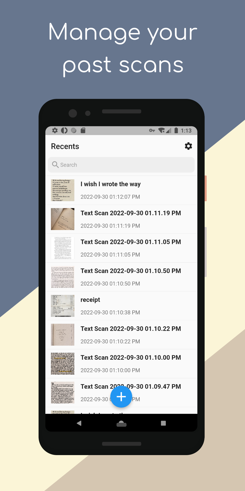
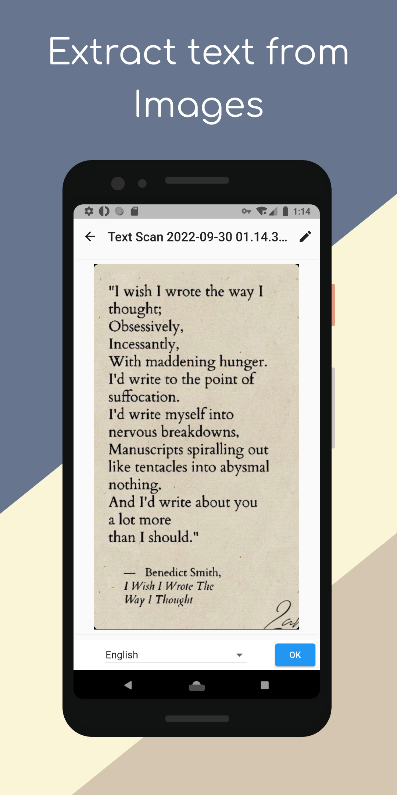
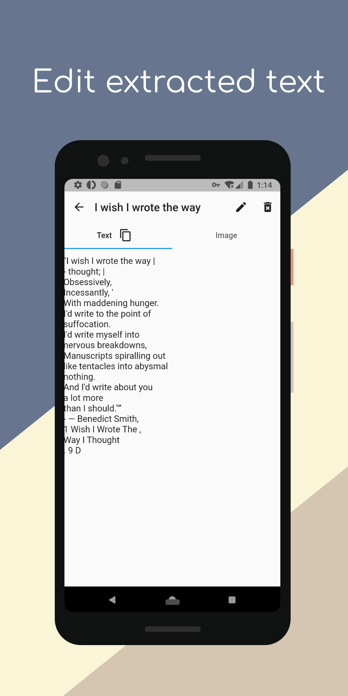
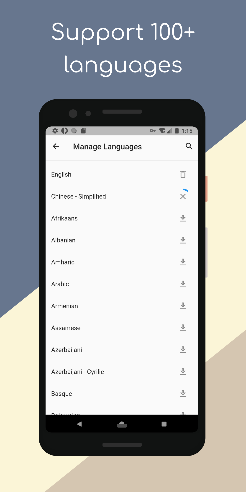

# Text Scanner

Text Scanner is a mobile android application that allows users to scan text from images and convert it to editable text. The application uses [Tesseract OCR](https://github.com/adaptech-cz/Tesseract4Android) engine to perform the text recognition. 

<table><tr>
    <td></td>
    <td></td>
    <td></td>
    <td></td>
</tr></table>